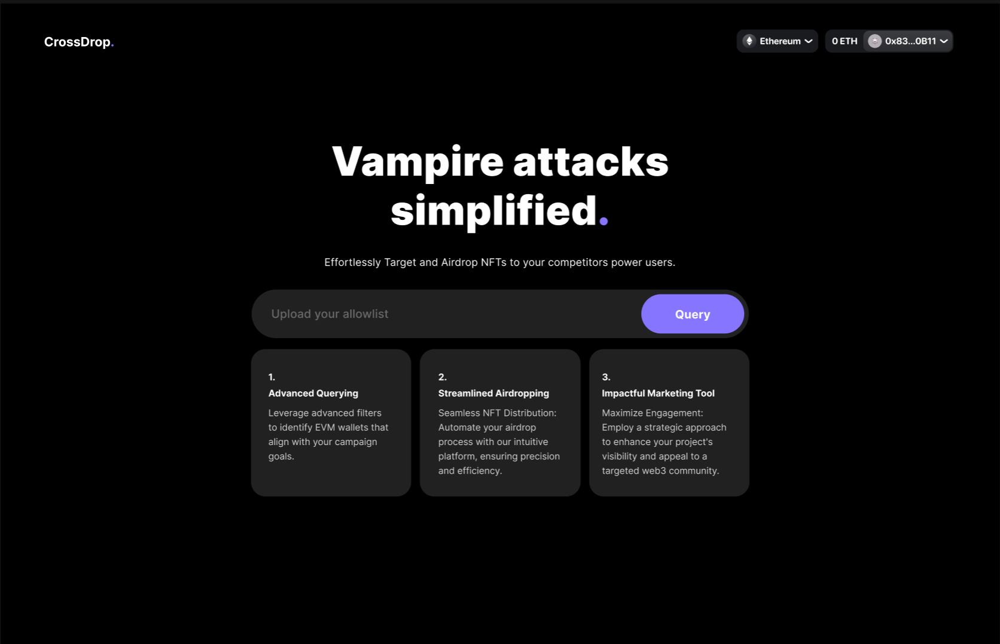
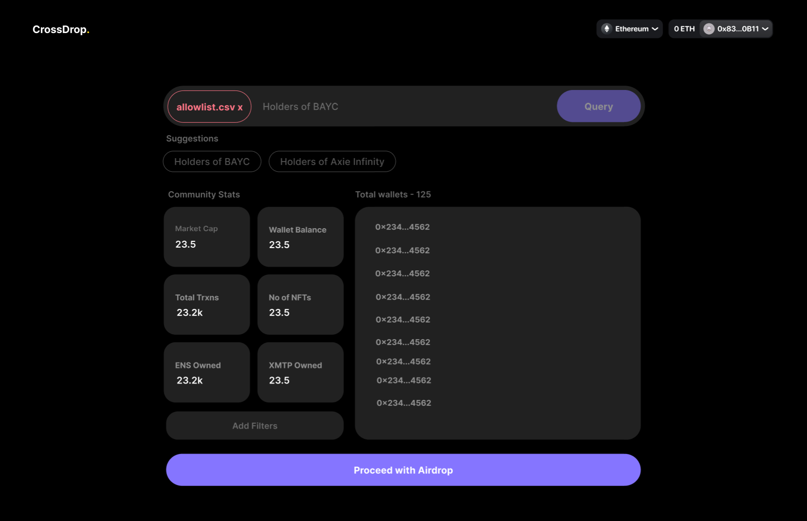
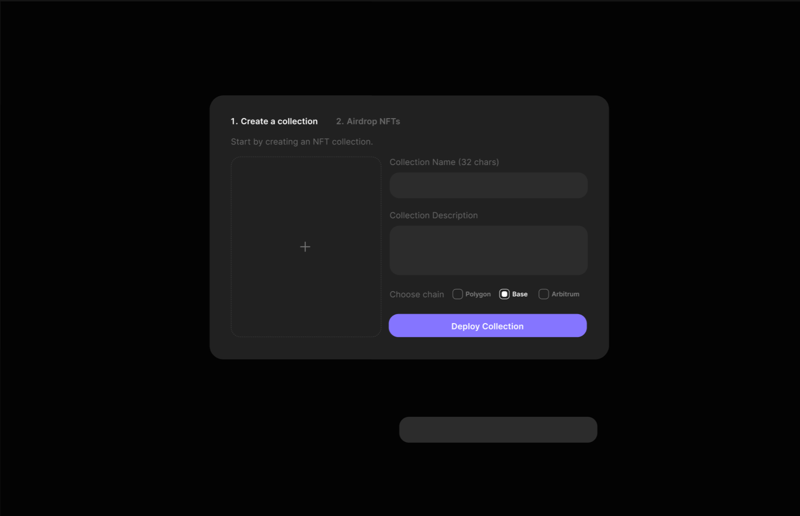

  

 

 Presenting

  

Targeted marketing and Ads for an On-Chain Audience</b>

<blockquote align="center"> 
  built on ☕ at <a href="https://ethindia.co">ETHIndia 2023</a>.

</blockquote>

# 💡 Problem Statement

Airdrops have played a crucial role in the intial capture of an audience for web3 companies. Targeted airdrops came into existence when businesses started focussing on quality of an audience compared to just quantity. However, there are few or no structured toolings which make targeted airdrops possible. That's where crossDrop comes into the picture
# 🧠 Knowledge Primer

- An _AirDrop_ is an important strategic tool for many Web3 projects. They are a way to distribute a project's native tokens to different addresses, on a set of criteria, to achieve a range of objectives

# 📺 Preview

  

  

  

  

  

# 🤝 Achievement

Winner of Arbitrum Track at ETHIndia 2023

# 💥 Contributors

                                                                                  
# 🚨 Forking this repo

Many people have contacted us asking if they can use this code for their own websites. The answer to that question is usually "yes", with attribution. There are some cases, such as using this code for a business or something that is greater than a personal project, that we may be less comfortable saying yes to. If in doubt, please don't hesitate to ask us.

We value keeping this site open source, but as you all know, _**plagiarism is bad**_. We spent a non-negligible amount of effort developing, designing, and trying to perfect this iteration of our website, and we are proud of it! All we ask is to not claim this effort as your own.

Refer to this handy [quora post](https://www.quora.com/Is-it-bad-to-copy-other-peoples-code) if you're not sure what to do. Thanks!
